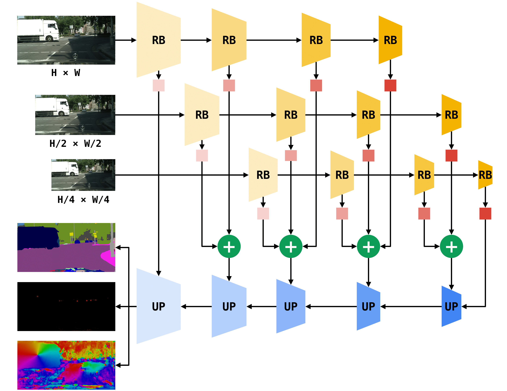

# Panoptic Swiftnet
Source code to reproduce results from [Panoptic SwiftNet: Pyramidal Fusion for Real-time Panoptic Segmentation](https://arxiv.org/abs/2203.07908).



This repository is based on [SwiftNet](https://github.com/orsic/swiftnet) and [Panoptic Deeplab](https://github.com/facebookresearch/detectron2/tree/main/projects/Panoptic-DeepLab) project from detectron2. 

## Requirements
- pytorch
- torchvision
- detectron2
- cupy
- cityscapesscripts
- panopticapi

## Datasets
- Cityscapes
- COCO
- Mapillary Vistas

Datasets should be inside "datasets" folder. Please prepare COCO and Cityscapes dataset according to the instructions from the detectron2. Mapillary Vistas folder should be named "mapillary_vistas" and the content should be equal to the official version of the dataset. 

## Evaluation
Weights for pretrained models are available on [google drive](https://drive.google.com/drive/folders/1Z8PTS1PwF5ol9yFdLcop5z9_la1uy67q?usp=sharing).

To evaluate a model run:

```
python train_net.py --config-file path/to/config/file.yaml --eval-only MODEL.WEIGHTS path/to/weights.pth
```

## Training

To train a model run with N GPUs run:

```
python train_net.py --config-file path/to/config/file.yaml --num-gpus N
```

Weights for the boundary aware offset loss need to be precomputed with script `data/save_offset_weights.py`.

## Demo inference on a single image

To visualize model predictions on a single image run:

```
python demo.py --config-file path/to/config.yaml --input path/to/image_or_folder --output path/to/output_folder MODEL.WEIGHTS path/to/pretrained_model_weights.pth
```

## TODO
- tensorrt
- time benchmarking

